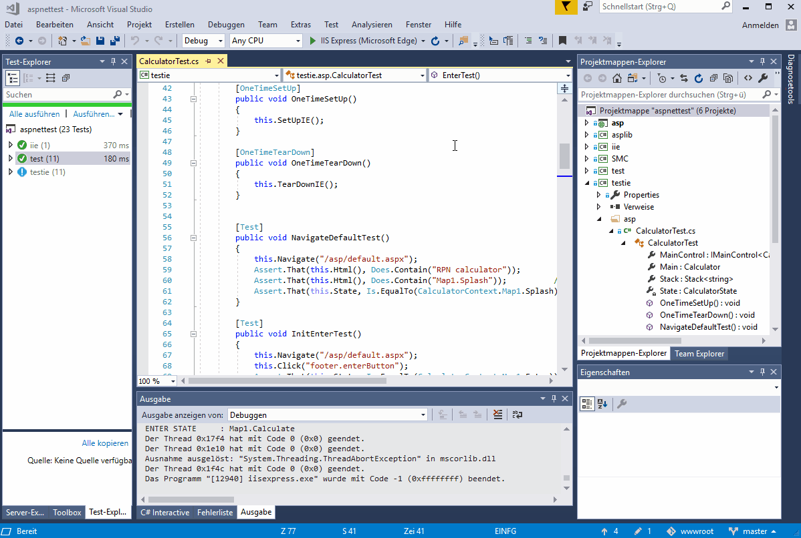

# aspnettest

[Technical Documentation](./doc/toc.md)

[Most recent development: Blazor Server](./doc/blazor.md),
[LinkedIn-Artikelserie (in German)](https://www.linkedin.com/pulse/blazor-1-disruptive-entwicklungen-toni-arnold)

## [Don't Develop GUI Tests, Teach Your App To Test Itself!](http://www.drdobbs.com/testing/dont-develop-gui-tests-teach-your-app-to/240168468) - in ASP.NET/NUnit/C#

*While* reading above article on Dr. Dobb's, I immediately knew: 
"This is it!" - even more so on the ASP.NET stack. Quote from  the article:

>	### GUI Test Cheating: Do It Yourself

> Basically, the premise for this development was:

> * What are the issues with GUI tests? Control detection and ease of development and maintenance.

> * How can we fix them? Well, let's avoid having to "find" the controls, and instead make them always available. Then, let's use our favorite language and environment to write the test code.

### Three ideas make up a whole

Running the GUI tests in the application process is just one of three orthogonal
concepts. Having a persistent monolithic core .NET application detached from the
concrete GUI framework is the second one. Whether it is persisted only across
requests (ViewState in WebForms terms, the DOM in SPA terms), the browser
session or a database entry referenced by a persistent browser cookie is an
interchangeable configuration detail (and can even be changed at runtime).
For-free transparent persistence allows programming just like a desktop
application where the class with `static void Main(string[] args)` naturally
provides static state memory that gets manipulated by GUI events.

The React/Redux combo implements a similar idea solely in Frontend-JS in a much
more elaborated, but also more "opinionated" way: It provides a central
monolithic state store (optionally persisted with the redux-localstorage npm
package) which gets manipulated by the state-changing "Reducer" in response to
"Actions" emitted by the GUI. The GUI updates itself reactively according to
global state changes. The core difference: Redux conceives global state as
*immutable* (the Reducer creates new state instances) while here, state is
conceived as *mutable*:

Persistence across requests is the precondition for implementing the application
as an SMC state machine as the third idea where button clicks perform state
transitions (mutating the object) and distinct states correspond to pages or
parts  displayed in the browser. The SMC part just decorates the application and
imposes no further restrictions on it - calling formal state transitions from
GUI events instead of class methods directly is just a matter of convention.
Automatically generating state diagrams as self-documentation is not the least
virtue provided by the SMC compiler. Concrete states can be viewed as short
names for a given set of (serialized) field values of the Main/state object.

When GUI events execute state transitions on a persistent SMC class statically
accessible to the testing class, test case assertions can observe the expected
model state directly and explicitly instead of guessing correctness indirectly
(and thus roughly) by observing the GUI state change triggered by the model
state change. In short:

1. In-process web application GUI test...
2. ...of a persistent, monolithic...
3. ...state machine...

...decoupled from the concrete web GUI framework (ancient WebForms, SSR MVC
core, WebSharper SPA (C# or F#), Blazor Server) makes the aspnettest way of
doing things (to my knowledge) unique - and blatantly ordinary at the same time,
simply based on the model of classic native desktop applications.

And even further: With WebForms (using `UpdatePanel`), WebSharper and Blazor
Server, nothing stands in the way of compositionally building up very complex
web applications made out of arbitrary many loosely coupled SMC monoliths, as
demonstrated with the respective triptych examples with three components not
even sharing the persistence mechanism (DOM, session and database).

### The different frameworks

The architecture presented has been implemented successively and isomorphically in these
frameworks in chronological order:

1. ASP.NET WebForms
2. ASP.NET Core MVC (Controllers and Actions)
3. WebSharper
4. Blazor Server

WebForms runs on .NET Framework and not on .NET Core like the other three
architectures. [WebSharper](./doc/websharper.md) seems to have been discontinued
now, and MVC Controllers and Actions never caught up to the old WebForms with
respect to an abstract in-memory representation of the page structure
(ultimately the DOM). Finally, Blazor Server arrived there where WebForms once
was:

The fully compositional Components (Blazor) roughly correspond to the User
Controls (WebForms). Both are statically accessed by the running tests and can
obtain the framework-generated unique ClientID resp. the (undocumented) ID HTML
attribute to unambiguously access DOM elements from the Browser.

In WebForms (and Core), synchronization is simple, as server round-trips always
entail a full HTTP request. WebSharper SPAs are completely different: There is
no synchronization, the tests have to wait and poll for changes to happen
(`AssertPoll`). Blazor Server changed the game again: The `OnAfterRender` resp.
`OnAfterRenderAsync` overrides allow a tight synchronization, as they're called
*on the server* after the JS client in the browser has finished rendering.


### In Code

The demo code is a direct port of my PHP example from [The State Machine Compiler](http://smc.sourceforge.net) 
(in the `.\examples\Php\web` folder).

The unit test on the left-hand side inherits from the `Calculator` app class,
directly calls the transition methods on the contained state machine and 
asserts its result states and the calculation result on the stack.

The GUI test on the right-hand side talks via COM to an Internet Explorer[*](#migration-to-selenium) instance, 
writes into a `TextBox` and clicks an ASP.NET `Button`. Indirectly, these clicks call
the very same transition methods on the state machine in the embedded `Calculator` instance 
and - this is the salient point - assert the result states strongly typed directly 
on that instance, exactly as in the unit tests. This is possible because the 
test engine runs in the same  address space as the Visual Studio Development Server. 
Moreover, the same test engine also has access to the rendered HTML and asserts the 
text of the calculation result in there, too.

<table>
<tr><th>Unit Test</th><th>GUI Test</th></tr>
<tr><td>

```csharp
[Test]
public void SqrtTest()
{
	this._fsm.Enter("");
	Assert.That(this.State, Is.EqualTo(CalculatorContext.Map1.Enter));
	this._fsm.Enter("49");
	Assert.That(this.State, Is.EqualTo(CalculatorContext.Map1.Calculate));
	var before = this.Stack.Count;
	this._fsm.Sqrt(this.Stack);
	Assert.That(this.State, Is.EqualTo(CalculatorContext.Map1.Calculate));
	Assert.That(this.Stack.Peek(), Is.EqualTo("7"));
	Assert.That(this.Stack.Count, Is.EqualTo(before));
}
```

</td><td>

```csharp
[Test]
public void SqrtTest()
{
	this.Navigate("/asp.webforms/default.aspx");
	this.Click("footer.enterButton");
	Assert.That(this.State, Is.EqualTo(CalculatorContext.Map1.Enter));
	this.Write("enter.operandTextBox", "49");
	this.Click("footer.enterButton");
	Assert.That(this.State, Is.EqualTo(CalculatorContext.Map1.Calculate));
	var before = this.Stack.Count;
	this.Click("calculate.sqrtButton");
	Assert.That(this.State, Is.EqualTo(CalculatorContext.Map1.Calculate));
	Assert.That(this.Stack.Peek(), Is.EqualTo("7"));
	Assert.That(this.Stack.Count, Is.EqualTo(before));
	Assert.That(this.Html(), Does.Contain(" 7\n"));
}
```

</td></tr>
</table>
		
To quote again:

>### How Does It Look and Feel?

>Since one video is worth a thousand pictures, check out this screencast recorded on a ~~Mac~~ win10 box running an initial GUI test suite:




## Migration to Selenium

All [Screen Recordings](./doc/recordings.md) were done with COM
SHDocVw.InternetExplorer. This IIE interface is now deprecated and being
[replaced with ISelenium](doc/migrate-iie-iselenium.md), as it is not functional
no more with current win10 versions.

ISelenium is currently still API compatible to the legacy IEE interface. The git
tag ```Examples-IIE-compatible``` marks the end of backwards compatibility for
the various In-App test examples.