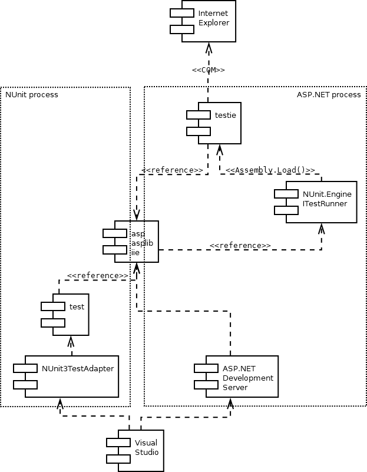
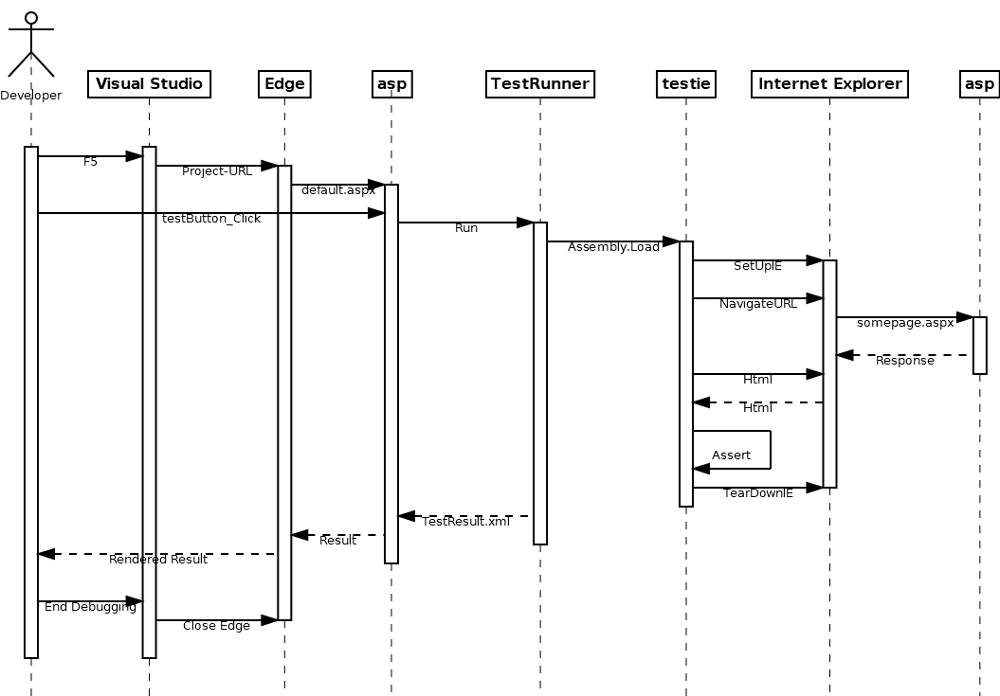

# Architecture

1. [Components](#components)
2. [Basic Internet Explorer Interaction](#Basic-Internet-Explorer-Interaction)


## 1. Components

The various projects are distributed over the components in the dependency tree below. 
The dotted box on the left hand side confines the NUnit address space when the tests are run
within Visual Studio, the box on the right hand side confines the ASP.NET address space
when the functional tests are started from the web application itself.

Both test variants verify the same web application with its libraries, therefore that
component appears in both boxes - but of course not at the same time.
 
Note the cyclic dependency the ```testie``` assembly takes part in:
The requirement is that all components live in the same ASP.NET address space,
thus ```asp``` needs to start (i.e. depends on) ```testie```, but ```testie```
of course also depends on ```asp``` as the application under test.

The cycle is broken up by providing the ```ITestRunner``` (started by ```asp```)
only with the late-bound physical path to the ```testie.dll``` file to load the test
assembly ultimately with a call to ```Assembly.Load()```.




## 2. Basic Internet Explorer Interaction

Opening an URL in Internet Explorer works the same way for all depth levels
of interaction between the various components:



