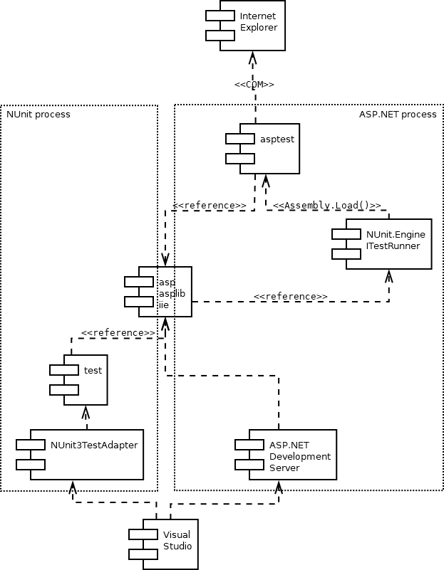
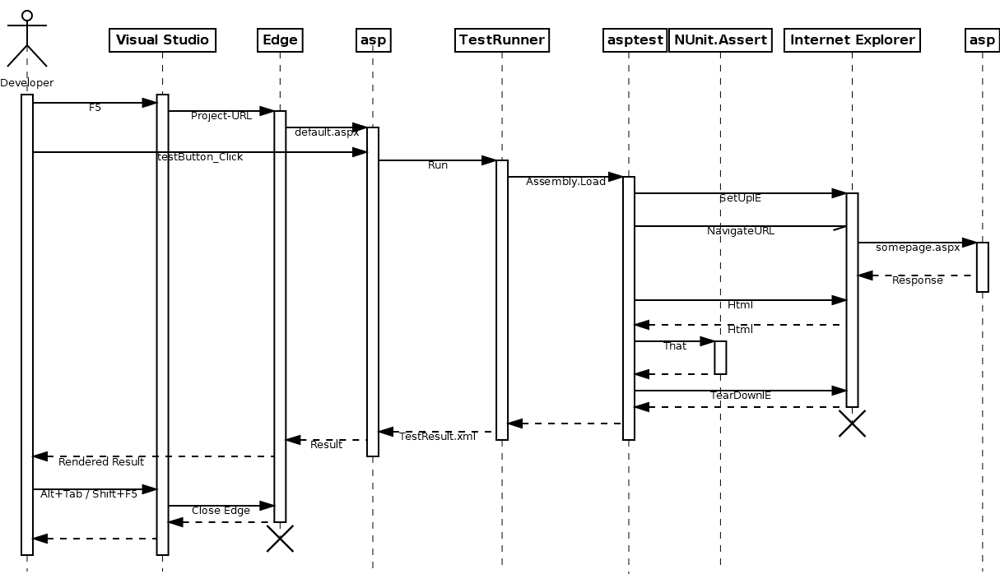
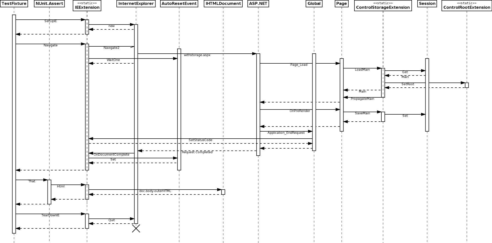

# Architecture

1. [Components](#1-components)
2. [Basic Internet Explorer Interaction](#2-basic-internet-explorer-interaction)
3. [IIE and IEExtension in Detail](#3-iie-and-ieextension-in-detail)
   * [Component Environment of IIE](#component-environment-of-iie)
   * [Using IIE in tests](#using-iie-in-tests)
   * [ASP.NET pages with IIE](#aspnet-pages-with-iie)
4. [Complete SetUp, Test, TearDown Sequence](#4-complete-setup-test-teardown-sequence)
   * [```minimaltest.WithRootTest``` Fixture](#minimaltestwithroottest-fixture)
   * [```minimaltest.WithStorageTest``` Fixture](#minimaltestwithstoragetest-fixture)
5. [Interacting with the Site](#5-interacting-with-the-site)
   * [```minimaltest.DefaultTest``` Interaction](#minimaltestdefaulttest-interaction)
   * [```minimaltest.WithRootTest``` Interaction](#minimaltestwithroottest-interaction)


## 1. Components

The various projects are distributed over the components in the dependency tree
below. The dotted box on the left hand side confines the NUnit address space
when the tests are run within Visual Studio, the box on the right hand side
confines the ASP.NET address space when the functional tests are started from
the web application itself.

Both test variants verify the same web application with its libraries,
therefore that component appears in both boxes - but of course not at the same
time.
 
Note the cyclic dependency the ```testie``` assembly takes part in: The
requirement is that all components live in the same ASP.NET address space, thus
```asp``` needs to start (i.e. depends on) ```testie```, but ```testie``` of
course also depends on ```asp``` as the application under test.

The cycle is broken up by providing the ```ITestRunner``` (started by
```asp```) only with the late-bound physical path to the ```testie.dll``` file
to load the test assembly ultimately with a call to ```Assembly.Load()```.




## 2. Basic Internet Explorer Interaction

Opening an URL in Internet Explorer works the same way for all depth levels of
interaction between the various components. This is the simplified basic
calling sequence:




## 3. IIE and IEExtension in Detail

This is a slightly abbreviated description of the static structure for all
depth levels of interaction between test engine, Internet Explorer and the
ASP.NET web application under test. 


### Component Environment of IIE


The SMC project dependency is of course only required for the ```Smc``` classes
and interfaces. Including SMC as a source project instead of a pre-built binary
of the ```FSMContext``` is only due to flexibility in architecture and
self-documentation, the sources are unmodified except some code analysis
warning suppression.


### Using IIE in tests

The test engine itself is implemented in the ```IEExtension``` class. The pure
marker interface ```IIE```  is used to pull in the extension methods and static
fields of the ```IEExtension``` into the respective test fixture.

The four concrete test fixture classes on the left hand side are the same as in
the four beginning sections of the [Writing GUI Tests](writing.md) document, in
ascending order of specificity and extent of functionality provided. A deeper
level requires everything from the upper level and adds more to it.


### ASP.NET pages with IIE

Again, the four concrete ```System.Web.UI``` classes on the right hand side
reflect the four beginning sections of the [Writing GUI Tests](writing.md)
document, parallel to above test fixtures.


## 4. Complete SetUp, Test, TearDown Sequence

The calling sequences during a test fixture differ only with regard to whether
the built-in storage mechanism is used or not, thus example 2. and 4. of
[Writing GUI Tests](writing.md) are analyzed in detail. The sequence diagrams
are close-up views starting with an instantiated test fixture in the
```minimaltest``` projects, after the test runner has loaded them in the
simplified basic sequence diagram above.


### ```minimaltest.WithRootTest``` Fixture

The following sequence diagram covers only this little test case without any further clicks:

```csharp
[Test]
public void NavigateWithRootTest()
{
    this.Navigate("/minimal/withroot.aspx");
    Assert.That(this.Html(), Does.Contain("<h1>minimalist test setup with root</h1>"));
}

```

The main objective of using ```IRootControl``` is to store a reference to the
currently executing page in the static member of the class
```ControlRootExtension``` in the ```Page_Load``` event and the returned HTTP
status code in the ```IEExtension```.


### ```minimaltest.WithStorageTest```` Fixture

The setup for the same test case, but this time with storage, is exactly
identical, and the storage itself is not used at all for simplicity:

```csharp
[Test]
public void NavigateWithStorageTest()
{
    this.Navigate("/minimal/withstorage.aspx");
    Assert.That(this.Html(), Does.Contain("<h1>minimalist test setup with storage</h1>"));
}
```

With ```IStorageControl<M>```, additionally to the reference stored in
```ControlRootExtension``` and the returned HTTP status code in
```IEExtension```, the ```M Main``` instance (in the diagram assumed to be
already created in a request beforehand) is fetched from the ```Session```
object of the page, eventually modified in a click event in between and at last
stored in the ```Session``` again.




## 5. Interacting with the Site

Here the calling sequences differ with regard to whether there is a dependency
on ```asplib``` for at least ```IRootControl``` to get the ```ClientID```, thus
example 1. and 2. of [Writing GUI Tests](writing.md) are analyzed.


### ```minimaltest.DefaultTest``` Interaction

Only this one-liner excerpt of a minimal interaction is sequenced:

```csharp
[Test]
public void ClickWithrootTest()
{
    this.ClickID("withroot-link");
}
```

Note that the ASP.NET component is not involved at all. That's just what makes
it a black box test.


### ```minimaltest.WithRootTest``` Interaction

Here the excerpt covers two lines of interaction: writing some text into a
```TextBox``` and then clicking the submit button:

```csharp
[Test]
public void WriteContentTest()
{
    this.Write("contentTextBox", "a first content line");
    this.Click("submitButton");
}
```

The sequence for the click event with an ASP.NET root control is a strict
superset of the black box test sequence.


