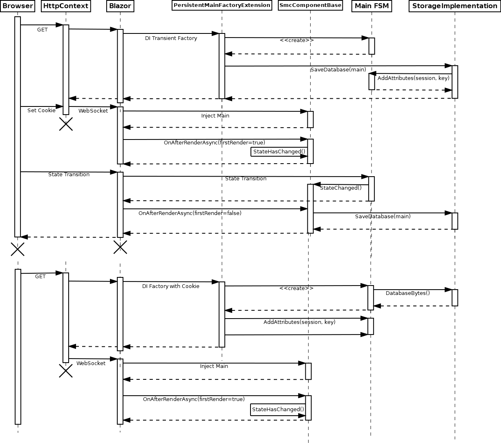

# ASP.NET Blazor Server

* [Summary](#summary)
* [Scaffolding of `minimal.blazor`](#scaffolding-of-minimalblazor)
  * [Using the static `TestFocus` accessor](#using-the-static-testfocus-accessor)
    * [Automatic synchronization with `TestFocus`](#automatic-synchronization-with-testfocus)
    * [@ref Component references](#ref-component-references)
  * [Persistence of the main state object](#Persistence-of-the-main-state-object)
    * [Database persistence sequence diagram](#database-persistence-sequence-diagram)
    * [Browser storage persistence sequence diagram](#browser-storage-persistence-sequence-diagram)
  * [Using the test project](#using-the-test-project)
* [`asp.blazor` with the SMC](#aspblazor-with-the-smc)
  * [The RenderMain override](#the-rendermain-override)
* [Comparison with bUnit](#comparison-with-bunit)
  * [Semantic HTML comparison in bUnit](#semantic-html-comparison-in-bunit)
  * [The `BUnitTestContext`](#the-bunittestcontext)

## Summary

[WebSharper](websharper.md) was made somewhat obsolete with the arrival of
Microsoft Blazor Server. The earlier Blazor WebAssembly was not considered
here, as only the server variant brings back the productivity that once was
possible with [ASP.NET WebForms](webforms-core.md) by abstracting away the
client-server communitacion and thus eliminates the need to program a separate
backend API.

From the testing point of view, Blazor Server is more similar to the
[WebSharper](websharper.md) experience, as it behaves as a JavaScript SPA on
the client side. Except for the initial HTTP request which initiates the
SignalR two-way connection used in later interactions, there are no subsequent
HTTP requests, thus there is no HttpContext available.

Traditional session persistence is not possible for that reason: The SignalR
communication doesn't allow to set session cookies. But database cookies can be
negotiated on the initial request, and further serialization of the stateful
main object doesn't require altering the cookie no more. The
`WithStorage.razor` template implements examples of these distinct
persistence mechanisms:

* Blazor - native persistence resembling ASP.NET WebForm's ViewState
* Database - implemented as in the other frameworks using a cookie
* Window.sessionStorage - JavaScript Session Storage provided by Blazor
* Window.localStorage - JavaScript local storage provided by Blazor

Unlike for WebSharper SPAs (and ultimately *all* modern SPA frameworks as
React and Anguler), there is no need to wait and poll for changes to happen
(`AssertPoll`), which turns out to be very brittle.

Instead, the `ITestFocus` static class in `asplib.blazor` provides an
`EndRender` resp. `EndRenderAsync` extension method to synchronize the tests.

## Scaffolding of `minimal.blazor`

The initial setup  in `Program.cs` adds the following required services to
the raw template provided bv VS2022:

```
builder.Services.AddSingleton<IConfiguration>(builder.Configuration);
ASP_DBEntities.ConnectionString = builder.Configuration["ASP_DBEntities"];
builder.Services.AddPersistent<Main>();
app.UseMiddleware<ISeleniumMiddleware>();
```

The first two lines set up the database connection string for database
persistence. The static `ASP_DBEntities.ConnectionString` is only required
for the Selenium NUnit tests (to clean up after the tests were run), as the the
.NET Core Dependency Injection is not available for the TestFixture class
instantiation by the NUnit framework. Storing the connection string in a static
member was common practice in the .NET Framework days, before DI.

`AddPersistent<Main>()` sets up the `PersistentMainFactoryExtension`
which serializes/deserializes the central `Main` state object.


### Using the static `TestFocus` accessor

To be able to statically access the test component in focus with a contained
main state object from within tests, inherit from the generic
`StaticComponentBase` as this in the Razor page:
```
@using asplib.Components
@inherits StaticOwningComponentBase<Models.Main>
```
This base class injects that central state object as a property `Main` into the
containing Component. In NUnit tests run from within the browser and thus the
ASP.NET core process, the state object can be accessed statically as
`TestFocus.Component.Main`. When inheriting from
`StaticOwningComponentTest<TWebDriver, TComponent, TMain>`, the instance is
directly accessible via the generic `Main` property.

#### Automatic synchronization with `TestFocus`

Blazor Components to be synchronized should call the `EndRender` resp.
`EndRenderAsync` extension method (defined in the
`ITestFocus`/`TestFocusExtension` static class in `asplib.blazor`) at the *end* of
its own `OnAfterRender` resp. `OnAfterRenderAsync` override (or simply inherit
from `StaticComponentBase`). This will set the `TestFocus.Event`
`AutoResetEvent` to allow the waiting test method to continue and assign itself
(the Blazor component instance) to `TestFocus.Component` if and only if its type
was brought into focus by `SetFocus`. This diagram shows the sequence of a page
request and a subsequent button click issued from an NUnit test fixture and its
synchronization with `TestFocus.Event`:

```csharp
[SetUp]
public void SetFocus()
{
    TestFocus.SetFocus(typeof(TComponent));
}

[Test]
public void ClickSubmitTest()
{
    Navigate("/Withstatic");
    Click(Component.submitButton);
}

```


The cause of the need for synchronization is Blazor's "Render" client-side
JavaScript: Selenium returns from `Navigate` requests resp. `Click` calls
*before* the page is rendered. To wait, the test thread blocks at `WaitOne` on
the `AutoResetEvent` of `TestFocus`, as can be seen in the overlapping within
Blazor's rendering process, here simply abbreviated as "Render". After having
finished, this process will cause a call to Blazor's virtual `OnAfterRender`
method on the server which calls our `EndRender` method outlined above. This
will call Expose() for the Component, which adds the static C# reference
`TestFocus.Component`.

#### @ref Component references

Therefore the statically referenced component under test is still instantiated
after the first Navigate() block (on the left and the second Click() block can
obtain the Id attribute through the `IdAttr()` extension method which in turn
accesses the ElementReference.Id instance property.

Blazor automatically generates a reference Guid when a Component or HTML element
reference is added through the [@ref
attribute](https://docs.microsoft.com/en-us/dotnet/architecture/blazor-for-web-forms-developers/components#capture-component-references).
This empty HTML attribute with the undocumented(?) `_bl_` prefix for the Guid
looks like this in Blazor-generated HTML (also for some built-in input
components except `InputRadio<T>` for which an implementation has already been
[committed in git](https://github.com/dotnet/aspnetcore/pull/40828), is planned
for the Blazor 7 release):

```html
<button type="submit" _bl_6a88286a-1854-4d65-b9b4-140850e5ae7e="">Submit</button>
```


### Persistence of the main state object

To make the main state object persistent, inherit from the
`PersistentComponentBase` instead:

```csharp
@using asplib.Components
@inherits PersistentComponentBase<Models.Main>
```

This also injects a property `Main`, but makes it persistent according to
the storage type configured in the calue `"SessionStorage"` in
`aspsettongs.json`. The value is parsed as the global `Storage` enum
from the global `asplib` .NET Standard project shared by all frameworks.

Valid values in ASP.NET Blazor Server are (the last two are exclusive for Blazor
and not availiable in .NET Core MVC ore WebForms):

 * `ViewState`
   - Disables persistence, state will not survive a SignalR reconnection.
 * `Database`
   - Serializes the main state into the database which makes a
     `"ASP_DBEntities"` connection string in `aspsettongs.json`
     mandatory. State will be available as many days as configured in
     `"DatabaseStorageExpires"`.
 * `SessionStorage`
   - Serializes the main state into the browser JavaScript Window.sessionStorage
     via ProtectedSessionStorage. This makes the state local to the browser tab,
     and it will survive SignalR reconnections.
 * `LocalStorage`
   - Serializes the main state into the browser JavaScript Window.localStorage
     via ProtectedLocalStorage. It is up to the browser how long it will
     retain the data.

The binary serialization in the browser is (additionally to the built-in
Protected*Storage mechanism) encrypted by the server-side secret
`"EncryptViewStateKey"` and thus not manipulable by the client. This should
be enough to justify re-enabling the otherwise newly by .NET per default as
"unsafe" declared binary serialization by setting
`EnableUnsafeBinaryFormatterSerialization` to `true` in the .csproj
file.


#### Database persistence sequence diagram

This sequence diagram shows the call sequence for database persistence over two
distinct browser sessions. That the `<<create>>` call to instantiate the Main
FSM is done by `ActivatorUtilities.CreateInstance` in the DI factory has been
omitted for brevity.



This UML sequence diagram is not formally correct, but rather illustrative.
Although the "HttpContext" is also a class, it doesn't call the Direct Injection
transient factory registered in the static `PersistentMainFactoryExtension`
class directly. The crucial fact to illustrate is the lifetime of the
HttpContext: It is only available during the initial GET request. Afterwards, it
will upgrade the HTTP connection to a SignalR WebSocket and dispose the
HttpContext instance.

The "Blazor" pseudo-class represents the whole Blazor Server Framework including
Direct Injection (DI), the SignalR connection to the browser and the component
lifecycle events, particularly the `OnAfterRenderAsync` override which serves
the purpose of hte `OnPreRender` event in the ASP.NET WebForms implementation
of the SMC pattern.

Also the `TypeDescriptor.AddAttributes` static method is not called on the "Main
SMC" object itself, but manipulates it by adding the  `DatabaseKeyAttribute` and
`DatabaseSessionAttribute`. This is required, as the Browser Cookie storing
these values is not available no more after the HttpContext has been disposed -
these attributes serve as a workaround.

Drawback of this pattern: Unlike in ASP.NET WebForms, the component must be
initially visible on the GET request to trigger the Database persistence
mechanism. But storing the serialized object server-side can be considered as a
legacy technique that is replaced with Browser LocalStorage which did not exist
when designing the database persistence mechanism.

On the other hand, Browser storage may cause significant network traffic from
the client on each state change (just the same as WebForms' ViewState PostBack)
if the serialized state object grows big. With database storage, the serialized
object data is only moved from the web server to the database server unless the
page gets reinitialized on the client (e.g. after a SignalR disconnect).


#### Browser storage persistence sequence diagram

This diagram exemplifies the usage of Blazor's `ProtectedLocalStorage` in the
Browser, but the call sequence is exactly the same for
`ProtectedSessionStorage`. The `ActivatorUtilities.CreateInstance` for
`<<create>>` in the DI factory has also been omitted here.


Unlike for the Database persistence diagram, there are no two separate blocks
(although `ProtectedLocalStorage` survives Browser restarts). As DI must
guarantee an instance right away (before it could be loaded from the Browser),
the Main FSM gets instantiated twice: The first default instance is an
initialization throwaway which gets overwritten with a stored instance.


### Using the test project

Adding an NUnit test button from the `iselennium.blazor` project is as simple as
adding

```html
@using iselenium.Components
<TestButton testproject="minimaltest.blazor" />
```

The `minimaltest.blazor` test project can't directly be referenced by the
Blazor application, as this would create a circular reference. The pattern used
in the solution is to add this post-build event which will copy the DLL to the
bin directory:

```
diff --binary $(TargetPath) $(SolutionDir)\src\bin
if errorlevel 1 xcopy /d /f /y $(TargetDir)\$(TargetName).* $(SolutionDir)\src\bin
```

and then reference the DLL created directly in the Blazor application under test.

The TestRunnerBase will load the DLL from the `bin` path parent to the
`Environment.ContentRootPath` which only works when run from VisualStudio
itself, but not from a release directory. However, the various Selenium Driver
.exe are not in the path anyway when running a published Blazor application via
run.bat - which, unlike .NET Core MVC, is required in Blazor for the `_content`
directoy from `asplib.blazor`.


## `asp.blazor` with the SMC

Unlike ASP.NET Core MVC or WebSharper, there is no additional ViewModel-like
wrapper necessary for the SMC class. The `Calculator.razor` example component
directly inherits persistence generically with the type of the SMC model class:
```
@inherits SmcComponentBase<Calculator, CalculatorContext, CalculatorContext.CalculatorState>
```

### The RenderMain override

The abstract `SmcComponentBase` scaffolds the setup of the SMC state machine
with its `HydrateMain` override that adds an event handler for state changes
which in turn will call the virtual `RenderMain` method. It is the
responsibility of the concrete component (`CalculatorComponent` in the example)
to dynamically display the parts according to the SMC state by using the
[DynamicComponent](https://docs.microsoft.com/en-us/aspnet/core/blazor/components/dynamiccomponent?view=aspnetcore-6.0)
which displays a sub-component according to its type:

```csharp
protected override void RenderMain()
{
    switch (Main.State)
    {
        case var s when s == CalculatorContext.Map1.Splash:
            pageType = typeof(Splash);
            break;

        case var s when s == CalculatorContext.Map1.Calculate:
            pageType = typeof(Calculate);
            break;
        (...)
    }
}
```

The `SmcComponentBase` also conveniently provides generic accessors for the
`Fsm` and its `State`.

## Comparison with bUnit

Tests based on the new [bUnit](https://bunit.dev/) library draw upon ordinary
unit tests running in the Test-Explorer of Visual Studio. As such, there is no
web server and no Selenium invoved: A tests directly instantiates a component by
calling the static `RenderComponent<T>()` factory which yields an
`IRenderedComponent<T>` instance.

This obtained object provides access to the `IRenderedFragment` produced by the
Blazor component and also directly to its instance itself. There is no static
`TestFocus` instance accessor and no synchronization necessary as with the
Selenium tests, as instantiation and rendering happen synchronously within the
test method. Assertions can directly read the global monolithic state object
in both testing paradigms alike.

The generated id HTML attributes for finding e.g. clickable buttons are as
undocumented as the ones provided by Blazor itself and differ slightly:

**Blazor Server**
```html
<button _bl_75ef2312-3b13-4dfe-925b-b29a10026a50="">Enter &gt;</button>
```

**bUnit**
```html
<button blazor:onclick="2" blazor:elementReference="d3e0716b-28b0-48d8-ac2e-33a3aa6cab47">Enter &gt;</button>
```

The reason for the difference lies in the fact that bUnit's internal `Htmlizer` is
a modified copy of Blazor's internal
[`HtmlRenderer`](https://source.dot.net/#Microsoft.AspNetCore.Mvc.ViewFeatures/RazorComponents/HtmlRenderer.cs)
according to the source comments.

In the bUnit documentation, these unambiguous instance reference id attributes
are not used for finding HTML elements (they also turned out to be left empty in
some cases, e.g. the enter button in the footer part of the
`CalculatorComponent` after state changes in the example). Instead, these are
located by arbitrary CSS selectors in the RenderFragment.

Accessing elements by id is an inheritance from the original ASP.NET WebForms
implementation of aspnettest. In WebForms, the `ClientID` property is *always*
generated, while in Blazor it is only generated when there is a `@ref` reference
to the element. One could argue that adding `@ref` component references just for
accessing elements within tests clutters the application with otherwise
unnecessary ids.

### Semantic HTML comparison in bUnit

It is encouraged to write tests as .razor classes in bUnit. These obviate the
need for quoting the HTML to structurally compare expected and actual HTML:

```csharp
var title = cut.Find("h2");
title.MarkupMatches(@<h2>RPN calculator</h2>);
```

However, IntelliSense seems to be less intelligent in .razor files and the
"pythonic" [raw string
literals](https://github.com/dotnet/csharplang/blob/main/proposals/raw-string-literal.md)
in C# 11 provide another way to prevent having to quote quotation marks in HTML
attributes.

### The `BUnitTestContext`

Without a browser, session persistence is not possible in the context of bUnit
tests - but if the component under test is configured as persistent, it uses the
corresponding services. Therefore the `BUnitTestContext` registers these
formallly. An `IWebHostEnvironment` mock is created by
[Moq](https://github.com/moq/moq).

That specialized `Bunit.TestContext` also provides some helpers around bUnit's
`blazor:elementReference` to be able to find HTML elements  in the "component
under test" (`cut`) by its Blazor Component `Instance` accessor like this (from
the `asptest.blazor.bunit` example):

```csharp
var cut = RenderComponent<CalculatorComponent>();
cut.Find(Selector(cut.Instance.footer.enterButton)).Click();
cut.Find(Selector(Dynamic<Enter>(cut.Instance.calculatorPart).operand)).Change("3.141");
```

Compared to the aspnettest/iselenium idiom with the static `Component` accessor in
the test fixture class itself:

```csharp
Navigate("/");
Click(Component.footer.enterButton);
this.Write(Dynamic<Enter>(Component.calculatorPart).operand, "3.141");
```