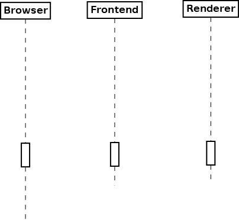

# WebSocket for Mandelbrot

The mandelbrot.\* projects compose together a microservice architecture
communicating over WebSockets by passing stateful SMC objects. Except the
external FractalSharp git-submodule by Chosen Few Software, the services are
written in F#, inclusive the WebSharper front-end JavaScript. 

An image is composed of a grid of several tiles that concurrently query the
`mandelbrot.frontend` service. If the tile is not found in its cache, the query
gets forwarded to the `mandelbrot.renderer` service, whilch will either serve
the image part out of its own cache or the renderer will start calculating and
rendering the image. 

The renderer itself is an SMC state machine progressing step by step, sending
back a message on each state transition which gets passed back to the original caller,
the browser, which reactively updates the current state.

## WebSocket sequence diagram

