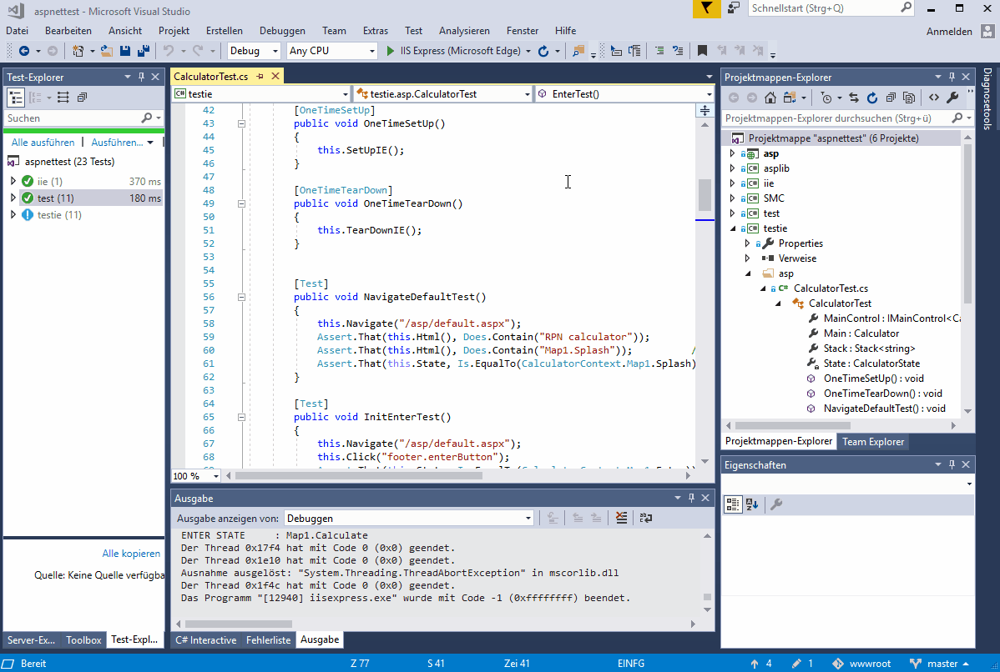
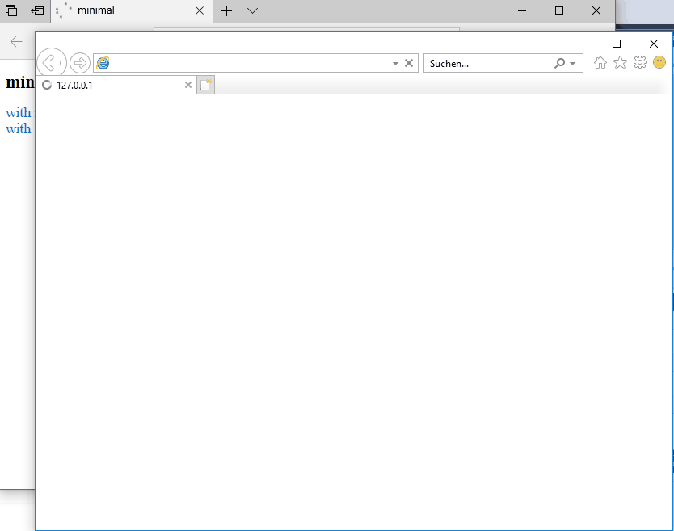
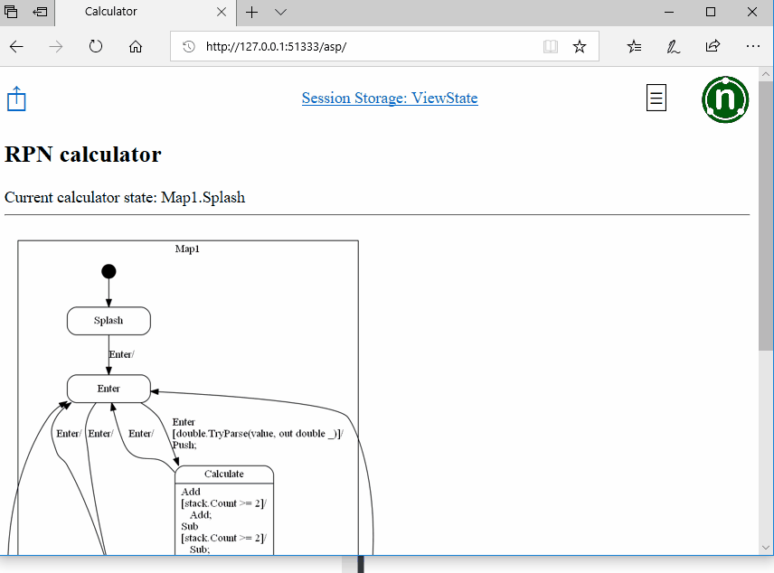

# Screen Recordings

* [Synopsis in the README](#synopsis-in-the-readme)
* [Core Dump on unhandled Exceptions](#core-dump-on-unhandled-exceptions)
* [Start a test in a pre-stored state (Fibonacci Sequence)](#start-a-test-in-a-pre-stored-state-fibonacci-sequence)

## Synopsis in the README

## Core Dump on unhandled Exceptions

## Start a test in a pre-stored state (Fibonacci Sequence)

