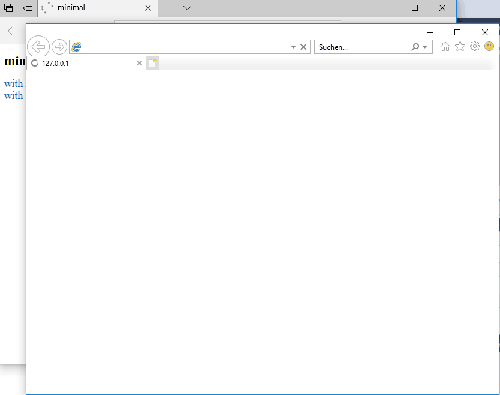

# Screen Recordings

* [Synopsis in the README](#Synopsis-in-the-README)
* [Core Dump on unhandled Exceptions](#Core-Dump-on-unhandled-Exceptions)

## Synopsis in the README

## Core Dump on unhandled Exceptions

