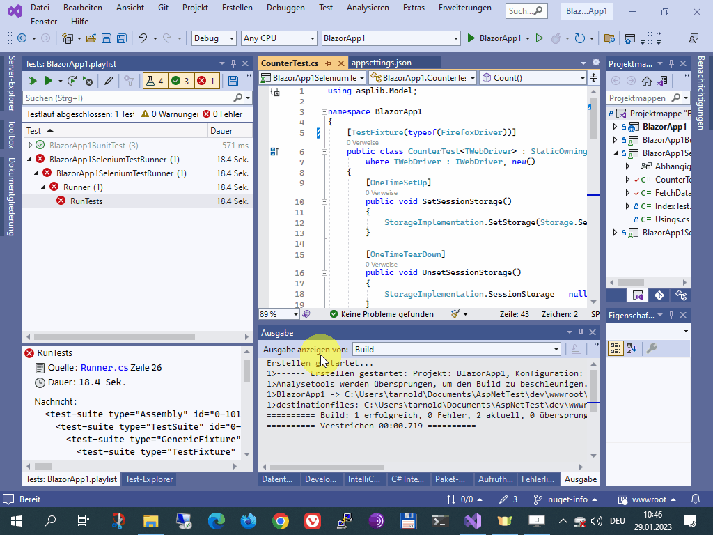

# Screen Recordings

[Bug #3](/../../issues/3): Due to (probably) win10 update 1809, Internet Explorer visibility is disabled in `SetUpIE()`,
as it cannot run no more in the foreground.

Later, win10 disabled http://127.0.0.1, not only for that reason the whole
project had to be [migrated from IIE to ISelenium](migrate-iie-iselenium.md) -
goodbye super-fast COM SHDocVw.InternetExplorer control,
Selenium.InternetExplorer.WebDriver is way slower.

There's currently no plan to re-record everything, thus these recordings are
rather historical.

* [Synopsis in the README](#synopsis-in-the-readme)
* [Core Dump on unhandled Exceptions](#core-dump-on-unhandled-exceptions)
* [Start a test in a pre-stored state (Fibonacci Sequence)](#start-a-test-in-a-pre-stored-state-fibonacci-sequence)


## Synopsis in the README

This is the test filter used to run this subset of the GUI tests:

```xml
<!-- For TestFilterBuilder.SelectWhere(), e.g. value="class == asptest.ExceptionDumpTest" -->
<add key="TestFilterWhere" value="class == asptest.calculator.CalculateTest ||
                                    class == asptest.calculator.SessionGridViewTest ||
                                    class == asptest.TriptychTest" />
```


## Core Dump on unhandled Exceptions

```xml
<add key="TestFilterWhere" value="class == asptest.ExceptionDumpTest" />
```


## Start a test in a pre-stored state (Fibonacci Sequence)

```xml
<add key="TestFilterWhere" value="class == asptest.calculator.FibonacciTest" />
```


## Blazor Template running the `BlazorApp1.playlist`


## Blazor Template Firefox click error

