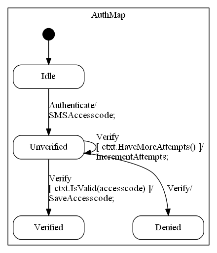
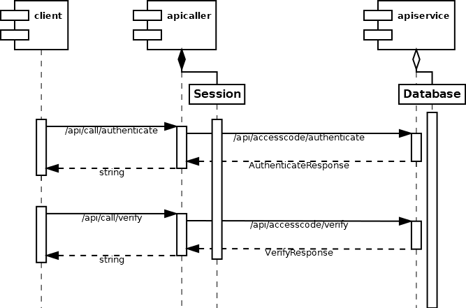

# REST API with SMC

* [SMC API service with database persistence](#smc-api-service-with-database-persistence)
* [API client with HTTP header persistence](#api-client-with-http-header-persistence)

The claim that REST APIs are stateless is counteracted with almost any
implementation, be it authentication state in a JWT header or implicit
application state written as entities to a database. The [SMC Telephone
Demo](http://smc.sourceforge.net/TelephoneFSM.htm) in fact closely resembles the
stateful callback API provided by commercial telephone service companies for
implementing automated call services. 

## SMC API service with database persistence

The `apiservice.core` Web API implements a much simpler finite state automaton.
The user sends an SMS verification request, receives the access code via another
channel (`SMSServiceMock` writes only to the console) and has three attempts to
enter that code:, which is then saved to the database together with the phone
number.



This stateful REST API requires persistence, in case of `apiservice.core` in the
database, in case of `apicaller.core` only in a server side session variable:



To achieve persistence is astonishingly simple, it suffices to just inherit from
`PersistentController`. The not-so-intuitive assignment to the private
`_serviceClientCookies` field for reading it in *another* follow up request is
commented in the code:

```csharp
[Route("api/[controller]")]
[ApiController]
public class CallController : PersistentController
{
    internal string[] _serviceClientCookies;

    [HttpPost("authenticate")]
    public async Task<ActionResult<string>> Authenticate([FromBody] string phonenumber)
    {
        var authenticateResult = await _serviceClient.Authenticate(phonenumber);
        _serviceClientCookies = _serviceClient.Cookies; // save in this session
        return authenticateResult;
    }

    [HttpPost("verify")]
    public async Task<ActionResult<string>> Verify([FromBody] string accesscode)
    {
        _serviceClient.Cookies = _serviceClientCookies; // resrore from the session for service state persistence
        return await _serviceClient.Verify(accesscode);
    }
}
```

From the client's perspective, there is no difference whether the session is
stored in the database or not. The API above would be used exactly like the
`apiservice.core` API in this shortened `apicaller.Services.ServiceClient`:

```csharp
public class ServiceClient : IServiceClient
{
    internal IConfiguration _configuration;
    internal IHttpClientFactory _clientFactory;

    public string[] Cookies { get; set; }

    internal HttpClient GetHttpClient()
    {
        var client = _clientFactory.CreateClient("ServiceClient");
        AddDefaultHeaders(client);
        return client;
    }

    public async Task<ActionResult<string>> Authenticate(string phonenumber)
    {
        using (var client = GetHttpClient())
        {
            var request = new AuthenticateRequest() { Phonenumber = phonenumber };
            var response = await client.PostAsync(ResouceUri("authenticate"), Json.Serialize(request));
            if (response.StatusCode != HttpStatusCode.OK) return new StatusCodeResult((int)HttpStatusCode.ServiceUnavailable);
            this.Cookies = response.Headers.GetValues(SetCookie).ToArray();
            var result = Json.Deserialize<MessageResponseDto>(response.Content);
            return result.Message;
        }
    }

    public async Task<ActionResult<string>> Verify(string accesscode)
    {
        using (var client = GetHttpClient())
        {
            var request = new VerifyRequest() { Accesscode = accesscode };
            var response = await client.PostAsync(ResouceUri("verify"), Json.Serialize(request));
            if (response.StatusCode != HttpStatusCode.OK) return new StatusCodeResult((int)HttpStatusCode.ServiceUnavailable);
            var result = Json.Deserialize<MessageResponseDto>(response.Content);
            return result.Message;
        }
    }

    internal void AddDefaultHeaders(HttpClient client)
    {
        client.DefaultRequestHeaders.Accept.Add(
            new MediaTypeWithQualityHeaderValue(Application.Json));
        client.DefaultRequestHeaders.Add(UserAgent, ".NET HttpClient");
        foreach (var cookie in Cookies ?? Enumerable.Empty<string>())
        {
            client.DefaultRequestHeaders.Add(HeaderNames.Cookie, cookie);
        }
    }
}
```

The `Cookies` property is persisted in the `CallController` using the
`ServiceClient`. That way, arbitrary long chains of stateful API calls become
possible.


## RESTful API client with HTTP header persistence

While `Database` or `Session` persistence require server side state storage in
all frameworks, `ViewState` persistence does not and is therefore kinda "truly
statelss". This "stateless state persistence" pattern was an achievement at the
time of classic VBScript.asp which needed explicit implementation as shown in
the PHP example from [The State Machine Compiler](http://smc.sourceforge.net)
(in the `.\examples\Php\web` folder).

In the nowadays mostly abandoned ASP.NET WebForms framework, the encrypted
ViewState for "stateless state persistence" came virtually for free, but was
mostly neglected by most architects and developers in favor of the then epidemic
PostBack-`Response.Redirect` pattern.

ViewState is implemented by using a hidden form input element for POST requests.
This conflicts with the pluralism of HTTP verbs for RESTful API requests and the
non-standardized body payload, thus nowadays the payload of a signed JWT Web
Token in the HTTP request header is sometimes used to securely make a nominally
stateless service stateful. But that shamefacedly hidden orthogonal other *state
transfer* within the REST "state transfer" paradigm doesn't need to be readable
by the client, simply encrypting it symmetrically instead of signing the
(client-readable) JWT state suffices.

The API-caller in the test examples must persist the cookie received from the
SMC service, but in the custom `X-ViewState` header instead of the ViewState input element
like in WebForms or  MVC Core:

`.\apitest.core\apicaller\appsettings.json`:

```json
{
  "SessionStorage": "Header",
  "EncryptViewStateKey": "<-- secret w/o server affinity -->"
}
```

That encrypted and thus non-manipulable header must be carried over to the next
request sent by the same client using the static
`StorageImplementation.SetViewStateHeader` method:

`apitest.apicaller.ServerTest`:

```csharp
using (var client = GetHttpClient())
{
    var responseAuth = client.PostAsync("/api/call/authenticate", Json.Serialize(DbTestData.PHONENUMBER)).Result;
    StorageImplementation.SetViewStateHeader(responseAuth, client);
    var resultAuth = Json.Deserialize<string>(responseAuth.Content);
    Assert.That(resultAuth, Does.StartWith("Sent an SMS"));
    Assert.That(resultAuth, Does.Contain(DbTestData.PHONENUMBER));

    for (int i = 0; i < 3; i++)
    {
        var responseWrong = client.PostAsync("/api/call/verify", Json.Serialize("wrong code")).Result;
        StorageImplementation.SetViewStateHeader(responseWrong, client);
        var resultWrong = Json.Deserialize<string>(responseWrong.Content);
        Assert.That(resultWrong, Does.StartWith("Wrong access code"));
    }

    var responseDenied = client.PostAsync("/api/call/verify", Json.Serialize("wrong code")).Result;
    StorageImplementation.SetViewStateHeader(responseDenied, client);
    var resultDeniedh = Json.Deserialize<string>(responseDenied.Content);
    Assert.That(resultDeniedh, Does.StartWith("Access denied"));
}
```

Note the orthogonality of the `response.Content` payload and the header payload in
the `SetViewStateHeader` implementation:

```csharp
/// <summary>
/// Add/Replace the X-ViewState default header on the client with the
/// new state received from the last response for the next request.
/// </summary>
/// <param name="response"></param>
/// <param name="client"></param>
public static void SetViewStateHeader(HttpResponseMessage response, HttpClient client)
{
    var viewState = response.Headers.GetValues(StorageImplementation.HeaderName).ToList();
    client.DefaultRequestHeaders.Remove(StorageImplementation.HeaderName);
    client.DefaultRequestHeaders.Add(StorageImplementation.HeaderName, viewState[0]);
}
```

The *size* of that header state representation is - unlike the virtually
unlimited size of form input elements in the request/response payload stream -
limited to a few kilobytes by the web server and competes with the other headers
(particularly the JWT token for authentication) for that limited space.
