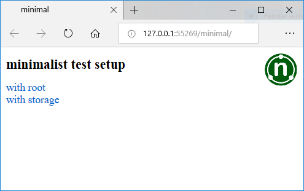

# Initial Setup

The Visual Studio solution requires some initial tweaking to get it up and running:

1. [Clone and tweak the solution](#Clone-and-tweak-the-solution)
2. [Optional rebuild dependencies](#Optional-rebuild-dependencies)
3. [NuGet package restore](#NuGet-Package-Restore)
4. [SQL database creation](#SQL-Database-creation)
5. [Running the unit tests](#Running-the-unit-tests)
6. [Running the web application self tests](#Running-the-web-application-self-tests)
7. [Let it rattle](#Let-it-rattle)


## 1. Clone and tweak the solution

 ```git clone git@github.com:toniarnold/aspnettest.git```

Open ```aspnettest.sln``` (the full solution) with Visual Studio 2017.
This step will create the hidden ```\.vs\config``` directory within the
```aspnettest``` root folder containing the ```applicationhost.config``` 
configuration file where the virtual directories for the two web site projects
are auto-configured with their respective ports. Open it with a text editor and
find for the relevant ```<bindings>``` by searching for ```:localhost```, 
as this is exactly the culprit:

```xml
<bindings>
    <binding protocol="http" bindingInformation="*:51333:localhost" />
</bindings>
```

Replace ```localhost``` with its IP address ```127.0.0.1``` in both websites, 
otherwise Internet Explorer will not work with your site (it really seems to be
a crippled down Internet Explorer, as it doesn't render CSS Flexbox nicely, regardless 
of Edge being installed on your system):

```xml
<bindings>
    <binding protocol="http" bindingInformation="*:51333:127.0.0.1" />
</bindings>
```

If not already present, Visual Studio will download and install the components required
for Visual C++ Makefile projects, as I considered ```nmake``` as the simplest
tool for handling SMC state machine generation - there is no C++ involved.

If you don't *re*-build the solution, the generated code files are already present
and ```nmake``` will not run.


## 2. Optional rebuild dependencies

For a complete rebuild from source, the Makefiles in the solution expect these additional binaries
present in ```%PATH%```:

* [```java.exe```](https://www.oracle.com/java/index.html) Java runtime for executing ./SMC/Smc.jar
  in order to generate .cs and .dot files from the portable .sm state machine source.
* [```dot.exe```](https://www.graphviz.org/download/) Graphviz to generate the
  splash images from .dot files.
* [```dia.exe```](http://dia-installer.de) GNU Dia for generating .png images from
  the .dia diagrams in ./doc


## 3. NuGet package restore

The whole project heavily depends on NUnit 3, and the database persistency layer
is built on Entity Framework 6 (EF6, with the "Database First" paradigm), so you'll need to 
perform a NuGet Package Restore.

Now you should be able to build the solution with the Any CPU Debug configuration.


## 4. SQL database creation

The solution contains a nested SQL Server Management Studio 17 solution in the
```.\db``` subdirectory, but it is trivial, you only really need the 
```Main.sql``` DDL script. Execute it on an SQL Database, its default name
is just ```[ASP_DB]```.

Adjust this connection string (the user iis/pass on my development
machine is no big secret):

```xml
<connectionStrings>
<add name="ASP_DBEntities" connectionString="metadata=res://*/Model.Db.csdl|res://*/Model.Db.ssdl|res://*/Model.Db.msl;provider=System.Data.SqlClient;provider connection string=&quot;data source=HP;initial catalog=ASP_DB;persist security info=True;user id=iis;password=pass;multipleactiveresultsets=True;application name=EntityFramework&quot;" providerName="System.Data.EntityClient" />
</connectionStrings>
```
...in these three .config files:

* ```.\asp\Web.config``` The full web application requiring SMC
* ```.\minimal\Web.config``` The minimized web application
* ```.\test\App.config``` The unit test suite outside the web applications


## 5. Running the unit tests

"A unit test talking to a database is not an unit test!" - well, then call it
shallow integration tests or whatever, the point is that the NUnit test suite
in the ```test``` project is intended to run within Visual Studio, while the
two functional test suites in the ```testie``` resp. ```minimaltest``` projects
can only succeed when called from the respective web application itself.

Therefore open  ```test.playlist``` within the Test Explorer, which contains
all the tests in only the ```test``` project. They should all succeed, and don't mind
the empty Internet Explorer window popping up just for the blink of an eye...


## 6. Running the web application self tests

It seems that in Windows 10 there is no simple way to grant the web application pool identity
the right to open Internet Explorer (on Windows 7 it could at least use it, but it had no right
to open its GUI), so the web application self tests need to be run in 
a Visual Studio debugging session.

As non-excluded exceptions interrupt the test procedure, I recommend to first debug
the ```minimal``` web application project. It will open a sparse web site with
a big green test button in the upper right corner:



Clicking on it will run the ```minimaltest``` suite, but it soon will interrupt
the debugger first with a ```InvalidOperationException```, then with a ```TestException```. 
Configure the Visual Studio debugger to not interrupt execution at least for this specific types 
of exception from the respective assemblies:


While at it, you can open the exception settings and exclude asp.dll from
interrupting on ```TestException```, too.

Now the tests should pass trough. In case of a failure, the default page
(from which the tests were started) will display a TestResult.xml
with the details of the problem:


## 7. Let it rattle

Once the minimalist test setup passes without break, chances are high
that the ```testie``` project (run from the ```asp``` startup project) will 
pass, too. Expect 1-2 minutes for all tests. 

Take care not to move the mouse pointer over the flashing 
Internet Explorer instance, as it will interfere with the ASP.NET client
side JavaScript and cause some tests to fail. Just placing it in a side
corner of the screen while waiting works best. Also continue with F5 instead
of mouse clicks when the debugger stops at an exception.
