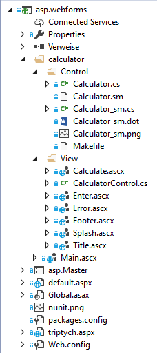
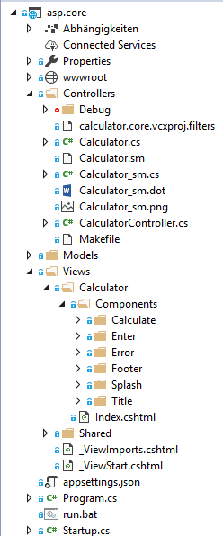
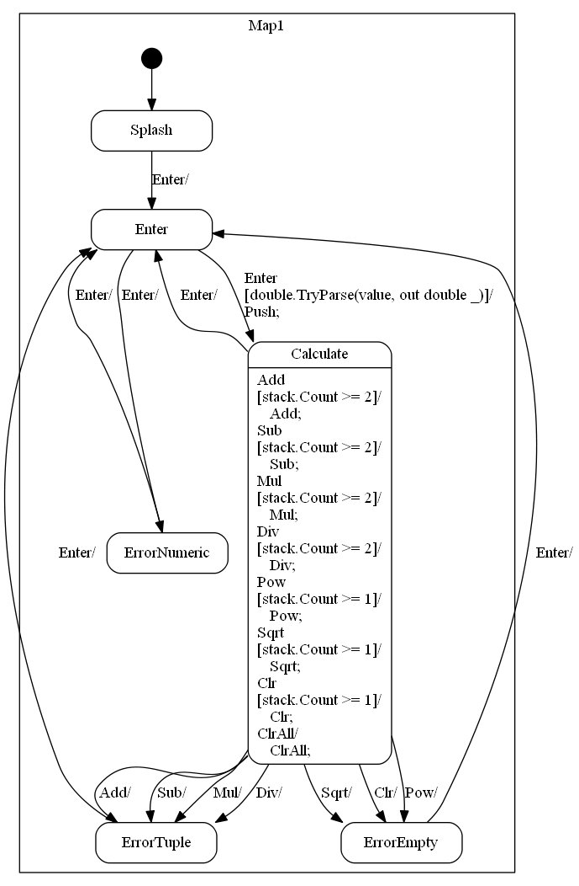

# ASP.NET WebForms and ASP.NET Core

* [Dependencies](#Dependencies)
   * [Identical Namespaces](#identical-namespaces)
* [Functional Equivalences](#functional-equivalences)
   * [Common Model Control View Structure](#common-model-control-view-structure)
   * [Session Persistence](#session-persistence)
   * [State Machine Compiler Coalescence](#state-machine-compiler-coalescence)
     * [PHP UI Parts Composition](#php-ui-parts-composition)
     * [WebForms UI Parts Composition](#webforms-ui-parts-composition)
     * [MVC Core UI Parts Composition](#mvc-core-ui-parts-composition)
   * [The Test Button](#the-test-button)
   * [Accessing HTML Form Elements](#accessing-html-form-elements)
     * [WebForms Controls](#webforms-controls)
     * [MVC Core Input Elements](#mvc-core-input-elements)
   * [Running the Tests](#running-the-tests)


## Dependencies

The general layout of the presented functional testing pattern originally has
been developed for the classic ASP.NET WebForms/.NET Framework stack. Ditto the
example application under test, which lays the ground for a general
Model-Control-View pattern with session persistence.

The newer ASP.NET Core counterpart is being developed with the idea in mind
that the original pattern is valuable on that shiny new web stack with MVC in
its name, too. The complete ```aspnettest``` solution inclures both stacks in
parallel, while the ```minimal.core``` and ```minimal.webforms``` solutions
isolate only the respectively required components:


### Identical Namespaces

A minimal web application in the original ASP.NET WebForms project only had two
direct dependencies: ```iie``` and ```asplib```. As can be seen in above
diagram, both have been split into three projects: A neutral .NET Standard base project
and two dependent subprojects with a ```.webforms``` resp. ```.core``` suffix,
depending on .NET Framework resp. .NET Core.

As these suffixes have absolutely no contentual meaning within dependent
projects (as they are completely determined by the type of project), they have
been elided from the namespace (but not from the assembly name, as they must
reside side-by-side).


## Functional Equivalences

The ```withstorage.aspx``` WebForms page respective the
```./Controllers/WithStorageController``` /
```./Views/WithStorage/Index.cshtml``` pair constitute an equivalent
application within their respective paradigm.

The traditional Model Control View pattern used here might at a first glance
seem more "natural" in ASP.NET Core MVC and somewhat superimposed on ASP.NET
Framework/WebForms - but the actual *implementation* in ASP.NET Core appears
somewhat "enforced", as that quote from [Andrew
Lock](https://andrewlock.net/controller-activation-and-dependency-injection-in-asp-net-core-mvc/)
(reproduced in ```StorageControllerActivator.cs```) might illustrate:

> If you need to do something esoteric, you can always implement
> ```IControllerActivator``` yourself, but I can't think of any reason that
> these two implementations wouldn't satisfy all your requirements!


### Common Model Control View Structure

The project structure of both ASP.NET WebForms and ASP.NET Core is very
similar: Both provide a central ```./calculator/Control``` resp.
```./Controllers``` folder with the session-persisted SMC finite state
automaton, in ASP.NET Core even collapsed into one single MVC Controller class
(the "something esoteric" above).

If the application were complex (i.e. requiring an elaborated object model
tree), there would also be a ```./Model``` folder in the WebForms project (as in
the ```asplib.webforms``` base project).

The ```./calculator/View``` resp. ```./Views/Calculator/Components``` subfolder
contain the partial views displayed according to the global application state
the SMC finite state automaton currently is in. The main view referencing these
UI components is ```./calculator/Main.ascx``` resp.
```./Views/Calculator/Index.cshtml```:





### Session Persistence

The primordial infrastructure requirement for both systems is some kind of
*session persistence*. While in ASP.NET WebForms, it practically comes for free
with the ```ViewState```, modern ASP.NET Core programmers allegedly don't know
no more, what a ViewState actually is and almost unwittingly end up with a
handcrafted zoo of ```<input asp-for="SomeStateValue" type="hidden"/>```
constructs to maintain fragmented state information across requests.

| Function | WebForms | Core |
| --- | --- | --- |
| Objects persisted | Dedicated serializable ```Main``` | All serializable fields of the MVC Controller class inheriting from ```SerializableController``` | 
| Hidden Input: Load the posted state | Explicit ```LoadMain()``` in the ```Page_Load``` event handler | Implicitly by  ```StorageControllerActivator``` |
| Hidden Input: Render the new state | Explicit ```SaveMain()``` in the ```OnPreRender``` event handler | Explicit ```<input viewstate="@ViewBag.ViewState" />``` in the View |
| Session Cookie: Load the stored state |  Explicit ```LoadMain()``` in the ```Page_Load``` event handler | Implicitly by ```StorageControllerActivator``` |
| Session Cookie: Save the new state | Explicit ```SaveMain()``` in the ```OnPreRender``` event handler | Implicitly by the ```IStorageController``` extension |
| Database Cookie: Load the stored state |  Explicit ```LoadMain()``` in the ```Page_Load``` event handler | Implicitly by ```StorageControllerActivator``` |
| Database Cookie: Save the new state | Explicit ```SaveMain()``` in the ```OnPreRender``` event handler | Implicitly by the ```IStorageController``` extension |


### State Machine Compiler Coalescence

[The State Machine Compiler (SMC)](http://smc.sourceforge.net]) provides a
specialized high level programming language for implementing the state pattern. 
In Charles W. Rapp's own words:
 
>Your application lives in a world of asynchronous, unordered events: mouse clicks, timeouts, messages, and OS signals.
>(...)
>
>But there's a hitch. Your detailed state diagrams are only pictures. How are
>you going to translate your drawings into code? A transition matrix is cryptic
>while switch statements means your state machine logic is scattered all over
>your code. 
>(...)
>
>Enter SMC - The State Machine Compiler. Now you put your state
>diagram in one file using an easy-to-understand language. SMC generates the
>state pattern classes for you.

The RPN calculator example in fact is *the same program* I've used as an
example for the PHP code generator for SMC - not particularly optimized for
usability as an everyday calculator, but as a blueprint for a bigger
wizard-like web application. This is its auto-generated state diagram (with
inline C# for the transition guards):



Pivotal is the mapping from central application state (the rectangles with
rounded corners in the diagram) to the visibility of parts in the "Composition
UI" pattern, which differs the most according to the framework used:


#### PHP UI Parts Composition

The ```switch``` statement operates on the state name and includes the
required UI parts:

```index.php```

```php
// Include the parts the web application is composed of.
include 'title.php';
echo "<hr>";

// Conditionally display the page belonging to a (now read-only) state.
switch($calculator->getStateName()) {
    // separate includes per state
    case 'Map1.Splash':
        include "Splash.php";
        break;
    case 'Map1.Enter':
        include "Enter.php";
        break;
    case 'Map1.Calculate':
        include "Calculate.php";
        break;
    // one error page for all error states,
    // parametrized with $errormsg
    case 'Map1.ErrorNumeric':
        $errormsg = "The input was not numeric.";
        include "Error.php";
        break;
    case 'Map1.ErrorTuple':
        $errormsg = "Need two values on the stack to compute.";
        include "Error.php";
        break;
    case 'Map1.ErrorEmpty':
        $errormsg = "Need two values on the stack to compute.";
        include "Error.php";
        break;
    default:
        throw new Exception(
            "Cannot display state {$calculator->getStateName()}");
}

echo "<hr>";
include 'footer.php';    // contains btn_Enter for the onload event
```


#### WebForms UI Parts Composition


The ```switch``` statement in the code-behind operates on the state symbols
validated at compile-time (using C# 7.0 "Pattern Matching with the Switch
Statement") and makes the required UI User Controls declared in the .ascx
visible:

```./calculator/Main.ascx```

```html
<uc:Title ID="title" runat="server" />
<hr />
<uc:Splash ID="splash" runat="server" />
<uc:Enter ID="enter" runat="server" />
<uc:Calculate ID="calculate" runat="server" />
<uc:Error ID="error" runat="server" />
<hr />
<uc:Footer ID="footer" runat="server" />
```

```./calculator/Main.ascx.cs```

```csharp
protected override void OnPreRender(EventArgs e)
{
    // This State->View visibility mapping is the central axis of the SMC pattern.
    this.title.Visible = true;

    switch (this.State)
    {
        case var s when s == CalculatorContext.Map1.Calculate:
            this.calculate.Visible = true;
            break;

        case var s when s == CalculatorContext.Map1.Enter:
            this.enter.Visible = true;
            break;

        case var s when s == CalculatorContext.Map1.ErrorNumeric:
            this.error.Visible = true;
            this.error.Msg = "The input was not numeric.";
            break;

        case var s when s == CalculatorContext.Map1.ErrorTuple:
            this.error.Visible = true;
            this.error.Msg = "Need two values on the stack to compute.";
            break;

        case var s when s == CalculatorContext.Map1.ErrorEmpty:
            this.error.Visible = true;
            this.error.Msg = "Need a value on the stack to compute.";
            break;

        case var s when s == CalculatorContext.Map1.Splash:
            this.splash.Visible = true;
            break;

        default:
            throw new NotImplementedException(String.Format("this.State {0}", this.State));
    }

    this.footer.Visible = true;

    this.SaveMain();
    this.sessionDumpGridView.DataBind();    // reflect saved changes

    base.OnPreRender(e);
}
```


#### MVC Core UI Parts Composition

The ```switch``` statement is basically the same as in WebForms, but assigns the required View Components to variables used in the
rendering part:

```./Calculator/Index.cshtml```

```csharp
@{
    // This State->View visibility mapping is the central axis of the SMC pattern.
    IHtmlContent title = null;
    IHtmlContent splash = null;
    IHtmlContent calculate = null;
    IHtmlContent error = null;
    IHtmlContent enter = null;
    IHtmlContent footer = null;

    title = await Component.InvokeAsync("Title", @Model);

    switch(Model.State)
    {
        case var s when s == CalculatorContext.Map1.Calculate:
            calculate = await Component.InvokeAsync("Calculate", @Model);
            break;
        case var s when s == CalculatorContext.Map1.Enter:
            enter = await Component.InvokeAsync("Enter");
            break;
        case var s when s == CalculatorContext.Map1.ErrorNumeric:
            ViewBag.Msg = "The input was not numeric.";
            error = await Component.InvokeAsync("Error");
            break;
        case var s when s == CalculatorContext.Map1.ErrorTuple:
            ViewBag.Msg = "Need two values on the stack to compute.";
            error = await Component.InvokeAsync("Error");
            break;
        case var s when s == CalculatorContext.Map1.ErrorEmpty:
            ViewBag.Msg = "Need a value on the stack to compute.";
            error = await Component.InvokeAsync("Error");
            break;
        case var s when s == CalculatorContext.Map1.Splash:
            splash = await Component.InvokeAsync("Splash");
            break;
        default:
            throw new NotImplementedException(String.Format("this.State {0}", Model.State));
    }

    footer = await Component.InvokeAsync("Footer");
}

<form asp-controller="Calculator" method="post">
    <input viewstate="@ViewBag.ViewState" />
    @title
    <hr />
    @splash
    @enter
    @calculate
    @error
    <hr />
    @footer
</form>
```


### The Test Button

In ASP.NET WebForms, the test button is a simple ImageButton and the test result a predefined class in ```iie```:

```html
<asp:ImageButton ID="testButton" runat="server" OnClick="testButton_Click"
    ImageUrl="nunit.png" CssClass="nunitimg" />
<iie:TestResult ID="testResult" runat="server"
    CssClass="testresult" />
```

The click event actually running the tests is implemented as follows:

```csharp
protected void testButton_Click(object sender, ImageClickEventArgs e)
{
    var testRunner = new TestRunner(this.Request.Url.Port);
    testRunner.Run("minimaltest.webforms");
    this.testResult.ResultString = testRunner.ResultString;

    if (testRunner.Passed)
    {
        this.testResult.Text = testRunner.PassedString;
    }
    else
    {
        this.testResult.RenderTestResult();
    }
}
```

In ASP.NET Core, all that functionality can't be combined into a single page as
easily. Button and result are just HTML links:

```html
<a asp-controller="Minimal" asp-action="Test" id="testButton">
    
</a>
<a class="testresult" asp-controller="Minimal" asp-action="Result">@Html.Raw(ViewBag.TestResult)</a>
```

They invoke actions on the named controller implemented as:

```csharp
/// <summary>
/// Run the test suite
/// </summary>
/// <returns></returns>
public IActionResult Test()
{
    var testRunner = new TestRunner(Configuration, Environment, (int)this.Request.Host.Port);
    testRunner.Run("minimaltest.core");

    if (testRunner.Passed)
    {
        ViewBag.TestResult = testRunner.PassedString;
    }
    else
    {
        return this.Result();
    }

    return View("index");
}

/// <summary>
/// View the test result as XML page
/// </summary>
/// <returns></returns>
public IActionResult Result()
{
    return Content(TestRunner.StaticResultString, "application/xml");
}
```


### Accessing HTML Form Elements

#### WebForms Controls

In ASP.NET WebForms, actually finding the Web-Control in the HTML DOM in
Internet Explorer was the main driving force for the original aspnettest
architecture, as it requires querying the actual control *instance* for its
framework-assigned ```ClientID``` (derived from the ID attribute) within the
library:

```html
<form id="form1" runat="server">
    <asp:TextBox ID="contentTextBox" runat="server"></asp:TextBox>
    <asp:Button ID="submitButton" runat="server"
        Text="Submit"
        OnClick="submitButton_Click" />
 </form>
```

Finding actual ASP.NET Control instances for assertions on the view level works
the same way by querying for the server ID attribute, see the abbreviated
example below. The central ```Main``` object for assertions on the Model level
is maintained by the testing infrastructure itself:

```csharp
[Test]
public void SubmitTest()
{
    this.Navigate("/minimal.webforms/withstorage.aspx");
    this.Select("storageList", "Database", expectPostBack: true);
    this.Write("contentTextBox", "a stored content line");
    this.Click("submitButton");
    // Assertions on the View level
    Assert.That(((BulletedList)this.GetControl("contentList")).Items[0].Text, Is.EqualTo("a stored content line"));
    // Assertions on the Model level    
    Assert.That(this.Main.Content[0], Is.EqualTo("a stored content line"));
}
```


#### MVC Core Input Elements

ASP.NET Core lacks an automatic unique id dispenser engine, and e.g. input
names directly correspond to the property names on the ViewModel. Therefore
there's neither need nor possibility for automatically obtaining computed ids -
they are just written down literally:

```html
<form asp-controller="WithStorage" asp-action="Submit" method="post">
    <input asp-for="ContentTextBox" />
    <button type="submit" id="SubmitButton">Submit</button>
</form>
```

In ASP.NET Core MVC, the terms "Model" and "Controller" don't map to the
terminology used above. There are no server side web controls, thus there are
no direct assertions on the View level possible - and the terminology is
confusing: The even "more modern" Model View ViewModel (MVVM) pattern in fact
has no correspondence in the ASP.NET Core framework itself, it is basically
just a naming convention for a programming pattern evocative of the fact that
the eponymous "Model" in "ASP.NET MVC" always *closely mirrored* the "View"¨and
therefore *always* belonged to the View layer in the sense of an intimate,
non-interchangeable dependency.

In aspnettest for ASP.NET Core, the counterpart to the central ```Main```
access point in ASP.NET WebForms is the serialized ```Controller``` maintained
by the testing infrastructure which - when derived from
```SerializableController``` - automatically assigns the ViewModel object used
in the last controller action as an accessible property to the Controller:


```csharp
/// <summary>
/// Typed accessor for the only ViewModel used in the app
/// </summary>
public WithStorageViewModel Model
{
    get { return this.Controller.Model; }
}

[Test]
public void SubmitTest()
{
    // Local setup: Store a value into the database
    this.Navigate("/WithStorage");
    this.Select("Storage", "Database", expectPostBack: true);
    this.Write("ContentTextBox", "a stored content line");
    this.Click("SubmitButton");
    // Assertions on the ViewModel level (= View level in WebForms)
    Assert.That(this.Model.Content[0], Is.EqualTo("a first content line"));
    // Assertions on the Controller level (= Model level in WebForms)
    Assert.That(this.Controller.ContentList[0], Is.EqualTo("a first content line"));
}
```

In the end, manipulating HTML forms looks almost identical on both stacks,
names beginning in lower case is just an informal convention for "field member
name of the code-behind object" (ASP.NET WebForms), names beginning in upper
case for "ViewModel property name" and accordingly "HTML input name" or - in
absence of both - "HTML id attribute".


### Running the Tests

ASP.NET WebForms tests require IIS which in turn can't open Internet Explorer
no more in current OS versions - therefore GUI tests can only be run from the
Visual Studio Debugger. 

ASP.NET Core tests on the other hand don't work in the
Visual Studio Debugger (the page under tests returns 400), but still can be
debugged by attaching the debugger to the dotnet.exe process started directly
or with run.bat:


| GUI Test Context | WebForms | Core |
| --- | --- | --- |
| Visual Studio Debugger | F5 (Debug) | - / HTTP 400 |
| Production Runtime | - / no IE | ```run.bat``` |
| Runtime Debugging | Attach to ```w3wp.exe``` | Attach to ```dotnet.exe``` |