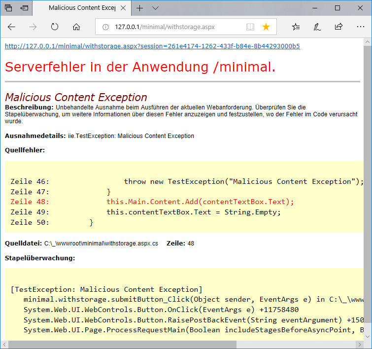

# Writing GUI tests

1. [```minimaltest.DefaultTest```: A view from the outside](#1-minimaltest.defaulttest-a-view-from-the-outside)
2. [```minimaltest.WithRootTest```: Don't hunt for web controls](#2-minimaltest.withroottest-dont-hunt-for-web-controls)
3. [```minimaltest.WithStorageTest```: Flexible persistency for a model object](#3-minimaltest.withstoragetest-flexible-persistency-for-a-model-object)
4. [```testie.asp.calculator.CalculateTest```: Directly access the state machine](#4-testie.asp.calculator.calculatetest-directly-access-the-state-machine)
5. [```minimaltest.ExceptionDumpTest```: Core Dumps](#5-minimaltest.exceptiondumptest-core-dumps)
6. [Database encryption](6-#database-encryption)
7. [```testie.asp.calculator.FibonacciTest```: Sharing session dumps for test case setup](#7-testie.asp.calculator.fibonaccitest-sharing-session-dumps-for-test-case-setup)

As stated in the motivational [README.md](../README.md), this project is all
about "teaching the app to test itself". For demonstration purposes, the
```minimal```/```minimaltest``` pair contains ascending stages of entanglement
between the test suite, the ASP.NET infrastructure and the
```SHDocVw.InternetExplorer``` COM component.

The full ```asp```/```testie``` pair tries to showcase the full potential of
the presented test pattern on a not-so-trivial ASP.NET Web Application project
using SMC, [The State Machine Compiler](http://smc.sourceforge.net), which in
itself serves as an example for putting together a rich user control with
predictable and auto-documented behavior.


## 1. ```minimaltest.DefaultTest```: A view from the outside

Except for the deliberately failing ```ClickControlThrowsTest()```, this
simple setup provides no real advantage over any test scripting engine 
besides the fact that anything is written in C#.

At least clickable elements are not hunt for by their coordinates within the 
window, but by their HTML ```id``` attribute, which therefore must be known in
advance and remain constant on layout changes. In ASP.NET web controls, the 
```ClientID``` is dynamically generated before rendering the page and thus 
will change when rearranging elements.

The sole introspection is implicitly performed by checking for HTTP status
200 OK after each click, but otherwise any result assertions must be performed
by analyzing the result HTML after a click on an element:

```csharp
[Test]
public void ClickWithrootTest()
{
    this.Navigate("/minimal/default.aspx");
    Assert.That(this.Html(), Does.Contain("<h1>minimalist test setup</h1>"));
    this.ClickID("withroot-link");
    Assert.That(this.Html(), Does.Contain("<h1>minimalist test setup with root</h1>"));
}
```

This test case first opens the default page of the minimalist test setup,
then clicks the first HTML link leading to the ```withroot.aspx``` page
and verifies its title.


## 2. ```minimaltest.WithRootTest```: Don't hunt for web controls

The second stage already implements most of the promises of the motivation
letter by requiring the associated Web Forms resp. Web Controls to inherit from
the ```IRootControl``` extension interface and explicitly setting the root
control of a potential control object composition tree as the root from which
navigation through the tree via reflection (with dot notation) will occur. This
is *the* minimal root page:

```csharp
using asplib.View;

public partial class withroot : System.Web.UI.Page, IRootControl
{
    protected void Page_Load(object sender, EventArgs e)
    {
        this.SetRoot();
    }
}
```

The ```SetRoot()``` method puts a static global reference to that very control,
therefore it cannot yet be garbage collected by the .NET runtime after the page
rendering has finished (until the next request), although specific page
```Request```/```Response``` objects will not be available no more.

But the auto-generated ```ClientID``` properties are still present, and this is
the crucial point: E.g. the ```this.Click("submitButton")``` action takes the
literal member name (here directly within the root object) of the corresponding
ASP.NET control:

```csharp
protected global::System.Web.UI.WebControls.Button submitButton;
```

The test runner gets a reference to it via reflection starting from the root
control and queries that object instance for its ```ClientID``` to be used with
```SHDocVw.InternetExplorer```.

The other way round, assertions can query ASP.NET control instances *directly*,
without the need to tamper with brittle regular expressions to be used in
assertions as in the first case with ```Does.Contain``` string extraction.

The condensed example test case:

```csharp
[Test]
public void WriteContentTest()
{
    this.Navigate("/minimal/withroot.aspx");
    this.Write("contentTextBox", "a first content line");
    this.Click("submitButton");
    Assert.That(((BulletedList)this.GetControl("contentList")).Items.Count, Is.EqualTo(1));
    var firstItem = (ListItem)((BulletedList)this.GetControl("contentList")).Items[0];
    Assert.That(firstItem.Text, Is.EqualTo("a first content line"));
}
```

All assertions directly operate on the typed
```System.Web.UI.WebControl.BulletedList``` instance with its ```ListItem```
collection created by ASP.NET infrastructure and directly query their
properties.

A more sophisticated example from ```testie.asp.calculator.SessionGridViewTest``` involving a
 ```GridView``` control:

```csharp
private GridView GridView
{
    get { return (GridView)this.GetControl("sessionDumpGridView"); }
}

private GridViewRow SelectRowContainig(string substr)
{
    return (from GridViewRow r in this.GridView.Rows
            where (
                from TableCell c in r.Cells
                where c.FindControl("stackLabel") != null &&
                    ((Label)c.FindControl("stackLabel")).Text.Contains(substr)
                select c).FirstOrDefault() != null
}
```

This LINQ query navigates though the ```GridViewRow``` instances of the
rendered ```GridView``` and returns those rows where a ```Label``` instance in
a cell contains a specific substring. Good lock with the attempt of achieving
that *reliably* with hand-crafted regular expressions on the result HTML of a
complex dashboard-like web application project with many GridViews...

>Some people, when confronted with a problem, think "I know,
>I'll use regular expressions." Now they have two problems.

...or alternatively parsing the generated HTML and navigating its DOM without
*concrete* knowledge of the HTML ids given by ASP.NET.


## 3. ```minimaltest.WithStorageTest```: Flexible persistency for a model object

Until now, test cases and assertions solely operated on the View level in a
traditional Model-Control-View architecture. I'm using the old-fashioned
nomenklatura to distinguish the concept from the new ASP.NET MVC, where what
they call "Model" in non-trivial applications IMHO in fact more resembles the
"Facade" GoF pattern, structurally still belonging to the View component.

The ```IStorageControl<SomeMainClass>``` extension interface requires the root
control and all its contained sub-controls to implement a property named
```Main``` (here of type ```SomeMainClass```) which can be any POCO ("Plain Old
C# Object"), with the only requirement of  having the ```[Serializable]```
attribute set. It acts as a singleton object for all views which individually
get a reference in their respective ```Main``` property. This at least to me
seems somewhat similar to the ```static class Program``` with its ```static
void Main()``` method in a classic WinForms.exe, hence the name.

In the ```withstorage.aspx``` example page, this "Model" object just contains a
list of content strings, in the ```asp.calculator.Main.ascx``` root control
inheriting from ```CalculatorControl``` (like its contained sub-controls), the
```Main``` object implements an SMC context class containing the SMC-generated
finite state machine.

This life cycle of the ```Main``` singleton as a container for all stateful
objects/values not automatically persisted in the control's ViewState is
maintained fully automatically by the ```IStorageControl``` extension. The
condensed minimal root control for implementing ```IStorageControl``` is:

```csharp
using asplib.View;

public partial class withstorage : System.Web.UI.Page, IStorageControl<ContentStorage>
{
    public ContentStorage Main { get; set; }
    public Storage? SessionStorage { get; set; }
    public new StateBag ViewState { get { return base.ViewState; } }

    protected void Page_Load(object sender, EventArgs e)
    {
        this.LoadMain();
    }

    protected override void OnPreRender(EventArgs e)
    {
        this.SaveMain();
        base.OnPreRender(e);
    }
}
```

On the test fixture side, the test class can inherit from
```StorageTest<SomeMainClass>``` to get typed accessors to that Model object.
Here's en excerpt of the extended WriteContentTest case:

```csharp
public void WriteContentTest()
{
    this.Write("contentTextBox", "a first content line");
    this.Click("submitButton");
    Assert.That(((TextBox)this.GetControl("contentTextBox")).Text, Is.Empty);
    // Assertions on the View level
    Assert.That(((BulletedList)this.GetControl("contentList")).Items, Has.Exactly(1).Items);
    Assert.That(((BulletedList)this.GetControl("contentList")).Items[0].Text, Is.EqualTo("a first content line"));
    // Assertions on the Model level
    Assert.That(this.Main.Content, Has.Exactly(1).Items);
    Assert.That(this.Main.Content[0], Is.EqualTo("a first content line"));
}
```


## 4. ```testie.asp.calculator.CalculateTest```: Directly access the state machine

The ```ISmcControl<FsmContextMain, FsmClass, StateClass>``` extension interface
specializes ```IStorageControl<M>``` interface for directly accessing the FSM
and its methods and properties. The condensed minimal root control (derived
from ```asp.calculator.View.CalculatorControl```) is:

```csharp
using asplib.View;

public partial class CalculatorPage : System.Web.UI.Page, ISmcControl<Calculator, CalculatorContext, CalculatorContext.CalculatorState>
{
    public ContentStorage Main { get; set; }
    public CalculatorContext Fsm { get { return this.Main.Fsm; } }
    public CalculatorContext.CalculatorState State
    {
        get { return this.Main.State; }
        set { this.Main.State = value; }
    }
    public Storage? SessionStorage { get; set; }
    public new StateBag ViewState { get { return base.ViewState; } }

    protected void Page_Load(object sender, EventArgs e)
    {
        this.LoadMain();
    }

    protected override void OnPreRender(EventArgs e)
    {
        this.SaveMain();
        base.OnPreRender(e);
    }
}
```

The ```State``` enumeration is intended to be used to control the
state-dependent visibility of sub-controls within the root control in the
OnPreRender element, as found in the ```asp.calculator.Main``` control of the
calculator application. The ```LoadMain()``` method  specifically looks for any
sub-controls of the same type as the root control and initially sets their
visibility to false such that they conditionally be made visible according to
the Fsm-State.

```csharp
    protected override void OnPreRender(EventArgs e)
    {
        this.title.Visible = true;

        if (this.State == CalculatorContext.Map1.Calculate)
        {
            this.calculate.Visible = true;
        }
        else if (this.State == CalculatorContext.Map1.Enter)
        {
            this.enter.Visible = true;
        }
        .
        .
        .
        else
        {
            throw new NotImplementedException(String.Format("this.State {0}", this.State));
        }

        this.footer.Visible = true;

        this.SaveMain();
        base.OnPreRender(e);
    }
```

But the same ```State``` resp. the whole ```Fsm``` is identically available in
the tests, as in the example test case used in the [README.md](../README.md)
file:

```csharp
[Test]
public void SqrtTest()
{
    this.Navigate("/asp/default.aspx");
    this.Click("footer.enterButton");
    Assert.That(this.State, Is.EqualTo(CalculatorContext.Map1.Enter));
    this.Write("enter.operandTextBox", "49");
    this.Click("footer.enterButton");
    Assert.That(this.State, Is.EqualTo(CalculatorContext.Map1.Calculate));
    var before = this.Stack.Count;
    this.Click("calculate.sqrtButton");
    Assert.Multiple(() =>
    {
        Assert.That(this.State, Is.EqualTo(CalculatorContext.Map1.Calculate));
        Assert.That(this.Stack.Peek(), Is.EqualTo("7"));
        Assert.That(this.Stack.Count, Is.EqualTo(before));
        Assert.That(this.Html(), Does.Contain(" 7\n"));
    });
}
```

As the ```Fsm```  itself is stateless, the assertions access its ```Stack```
(which turns it into a pushdown automaton). The last assertion for the result
in ```this.Html()``` in contrast is a very weak regular expression checking
that the result number is surrounded by whitespace (and not an arbitrary digit
of another number).


## 5. ```minimaltest.ExceptionDumpTest```: Core Dumps

The database storage mechanism is also enabled if another session storage is
configured, but the ```Global.asax``` of the web application inherits from
```iie.Global```. In that case, whenever an unhandled exception produces a YSOD
(Yellow Screen Of Death) with a HTML link to the root page containing the
serialized ```Main``` in the state when the exception occurred:



In the concrete case, the triggering input ("Exception") was not yet stored in
```Main``` and thus is lost, but otherwise, its state is retained and can
directly be reproduced with the link on top. 

Alternatively, the developers just need to scan the IIS logs for core dump
session links of the form:
```
CORE_DUMP=http://localhost/minimal/withstorage.aspx?session=27611b2a-b567-4935-a853-d2b4785393f7
```
...which directly point to a stored test case to be used for strictly TDD bug
fixing, i.e. Test Driven Development: A failing test case which exposes the bug
is created beforehand and only afterwards those changes are made that make that
failing test case pass.

And this User Story in a broadly Agile sense can almost literally be
transcribed into C# test code:

```csharp
[TestFixture]
public class ExceptionDumpTest : StorageTest<ContentStorage>
{
    [Test]
    public void ThrowRetrieveDumpTest()
    {
        this.Navigate("/minimal/withstorage.aspx");
        this.Write("contentTextBox", "a benign content line");
        this.Click("submitButton");
        this.AssertBenignLine();
        this.Write("contentTextBox", "Except");
        this.Click("submitButton", expectedStatusCode: 500);
        Assert.That(this.Html(), Does.Contain("Malicious Content Exception"));
        // The benign content in the ViewState is lost on the ysod-Page -> Click the core dump of Main
        var linkToDump = this.GetHTMLElement(IEExtension.EXCEPTION_LINK_ID);
        var coredumpUrl = (string)linkToDump.getAttribute("href");
        Assert.That(coredumpUrl, Does.Contain("/withstorage.aspx?session="));
        this.ClickID(IEExtension.EXCEPTION_LINK_ID);
        this.AssertBenignLine();    // restored from the dump before the exception
        this.TearDownIE();
        // Next week the bug is still unresolved -> do more postmortem debugging
        this.SetUpIE();
        this.NavigateURL(coredumpUrl);
        this.AssertBenignLine();    // restored again in a new Internet Explorer instance
    }

    private void AssertBenignLine()
    {
        Assert.Multiple(() =>
        {
            // Model
            Assert.That(this.Main.Content, Has.Exactly(1).Items);
            Assert.That(this.Main.Content[0], Is.EqualTo("a benign content line"));
            // View
            Assert.That(((BulletedList)this.GetControl("contentList")).Items.Count, Is.EqualTo(1));
            Assert.That(((BulletedList)this.GetControl("contentList")).Items[0].Text, Is.EqualTo("a benign content line"));
        });
    }
}
```

The ```ExceptionDumpTest``` in action:


## 6. Database encryption

Above core dumps (and database storage in general) imply a huge security issue
in itself: Regardless how sophisticated your access control mechanism on the
web application level are, a core dump contains all the potentially sensitive
data stored in ```Main``` and can be loaded by any user with access to the
application itself. To prevent such problems, database encryption can be
enforced in the ```Web.config``` with:

```xml
<add key="EncryptDatabaseStorage" value="True" />
```
 
The symmetric AES encryption key is stored in a cookie in the user's web
browser and nowhere else. Therefore the page can only be opened statefully in
that specific browser instance, therefore when the person causing the exception
is actually logged in.

But these encrypted core dumps still empower developers to send session links
to the persons experiencing the error, visit them in person and trying to
investigate while looking over their shoulder - a new ritual which rapidly
curtails tedious interrogations starting with "WTF *precisely* have you done
last week to get that alien show-stopper error we're unable to reproduce?"


## 7. ```testie.asp.calculator.FibonacciTest```: Sharing session dumps for test case setup

*If* you had placed this share button:

```xml
<asplib:ShareButton ID="shareButton" runat="server"
    OnServerClick="shareButton_Click" />
```
...on the failing web application, you could additionally politely ask the
error victims to click on it and email the downloaded file to you. This
bypasses the storage encryption - whether it is a good idea to empower people
to email around unencrypted session dumps of their otherwise highly protected
application data is another question.

But that is not the primary use case, the share button addresses another issue
with automated testing: to easily set up test data sets for complex web
applications. It is tedious to manually instantiate objects and to populate
them property by property with test data in a test setup coded purely in C# -
when on the other hand you have crafted a custom-tailored rich GUI to enter
precisely that particular test data you have in mind.

Perform these steps to create a stored test case:

1. Put your application in the desired state through the GUI, just as any user would.

2. When happy with the current state, click on this Share button:  
   

3. Choose "Save As" and enter a filename ending with .sql (if you're not on Edge
   which tries to protect you from yourself and enforces the .aspx suffix).

4. Open the file in Management Studio. The file SQL should look like this:
```sql
INSERT INTO Main (main) SELECT 0x0001000000FFFFFFFF01000000000000000C020000003A617370...
SELECT session FROM Main WHERE mainid = @@IDENTITY
```

5. Execute the script. It will output the session GUID just created. To be able to
   reproduce the test data anywhere, edit the script to include the now fixed GUID
   such that it looks like ```testie.asp.calculator.FibonacciTest.sql```:
```sql
INSERT INTO Main (session, main) SELECT 'DE2CAAF5-6602-456D-B1F9-874095359593', 0x0001000000FFFFFFFF01000000000000000C020000003A617370...
SELECT session FROM Main WHERE mainid = @@IDENTITY
```

6. Configure the GUID in the Web.config of the application under test:
```xml
<add key="testie.asp.calculator.FibonacciTest" value="DE2CAAF5-6602-456D-B1F9-874095359593"/>
```

7. Add the setup to your test case by sending the GUID to the application
   such that you can directly start your tests in the stored state. 


The the direct link to the stored session you have inserted with the
```testie.asp.calculator.FibonacciTest.sql``` during the initial setup is
[http://127.0.0.1/asp/default.aspx?session=DE2CAAF5-6602-456D-B1F9-874095359593](http://127.0.0.1/asp/default.aspx?session=DE2CAAF5-6602-456D-B1F9-874095359593)

This is the *complete* test fixture for the Fibonacci GUI test in ```testie.asp.calculator```:

```csharp
[TestFixture]
[Category("SHDocVw.InternetExplorer")]
class FibonacciTest : CalculatorTestBase
{
    [Test]
    public void VerifyFibonacciSums()
    {
        // Load the stored canonical test case
        this.Navigate(string.Format("/asp/default.aspx?session={0}",
            ConfigurationManager.AppSettings["testie.asp.calculator.FibonacciTest"]));
        Assert.That(this.Stack.Count, Is.GreaterThan(0));   // non-empty number list
        Assert.That(this.State, Is.EqualTo(CalculatorContext.Map1.Calculate));

        // Assert the sums backwards in the GUI
        // Note that the test uses string comparison, there is no arithmetic involved
        // in the assertions - the test gives no hint that it is about math!
        while (this.Stack.Count >= 3)
        {
            var initialStackCount = this.Stack.Count;

            // Get the head of the sequence to check
            var sum = this.Stack.ElementAt(0);
            var summand1 = this.Stack.ElementAt(1);
            var summand2 = this.Stack.ElementAt(2);

            // Check the correctness of the Fibonacci sequence  in the calculator GUI

            // Delete the current sum and recalculate it from the sequence
            this.Click("calculate.clrButton");
            this.Click("calculate.addButton");
            Assert.That(this.Stack.FirstOrDefault(), Is.EqualTo(sum));

            // Delete the calculated check sum
            this.Click("calculate.clrButton");

            // Put the original summands onto the stack again
            this.Click("footer.enterButton");
            this.Write("enter.operandTextBox", summand2);
            this.Click("footer.enterButton");

            this.Click("footer.enterButton");
            this.Write("enter.operandTextBox", summand1);
            this.Click("footer.enterButton");

            // Check that the loop will terminate by continuing with N-1 elements
            Assert.That(this.Stack.Count, Is.EqualTo(initialStackCount - 1));
        }
    }
}
```

And this is the mirror of above test without IE, asserting solely on the POCO
Control/Model class in ```test.asp.calculator.Control```:

```csharp
[TestFixture]
[Category("DbContext")]
public class FibonacciTest
{
    [Test]
    public void VerifyFibonacciSums()
    {
        Calculator inst;
        using (var db = new ASP_DBEntities())
        {
            inst = Main.LoadMain<Calculator>(
                Guid.Parse(ConfigurationManager.AppSettings["asp.calculator.Control.FibonacciTest"]));
            inst.Fsm.Owner = inst;  // As in ISmcControl.LoadMain<M, F, S>(), see SMC Manual Section 9
        }
        Assert.That(inst.Stack.Count, Is.GreaterThanOrEqualTo(3));  // non-empty sequence
        Assert.That(inst.State, Is.EqualTo(CalculatorContext.Map1.Calculate));

        // Assert the sums backwards on the model objects instead of the GUI
        while (inst.Stack.Count >= 3)
        {
            var initialStackCount = inst.Stack.Count;

            // Get the head of the sequence to check
            var sum = inst.Stack.ElementAt(0);
            var summand1 = inst.Stack.ElementAt(1);
            var summand2 = inst.Stack.ElementAt(2);

            // Check the correctness of the Fibonacci sequence  in the calculator GUI

            // Delete the current sum and recalculate it from the sequence
            inst.Fsm.Clr(inst.Stack);       // this.Click("calculate.clrButton");
            inst.Fsm.Add(inst.Stack);       //this.Click("calculate.addButton");
            Assert.That(inst.Stack.ElementAt(0), Is.EqualTo(sum));

            // Delete the calculated check sum
            inst.Fsm.Clr(inst.Stack);       // this.Click("calculate.clrButton");

            // Put the original summands onto the stack again
            inst.Fsm.Enter("");             // this.Click("footer.enterButton");
            inst.Fsm.Enter(summand2);       // this.Write("enter.operandTextBox", summand2);
                                            // this.Click("footer.enterButton");

            inst.Fsm.Enter("");             // this.Click("footer.enterButton");
            inst.Fsm.Enter(summand1);       // this.Write("enter.operandTextBox", summand1);
                                            // this.Click("footer.enterButton");

            // Check that the loop will terminate by continuing with N-1 elements
            Assert.That(inst.Stack.Count, Is.EqualTo(initialStackCount - 1));
        }
    }
}
```

And this is how the Fibonacci test looks like when unleashed - unit tests don't
look as mesmerizing. Note that it directly starts with the sequence entered
during test case creation:


